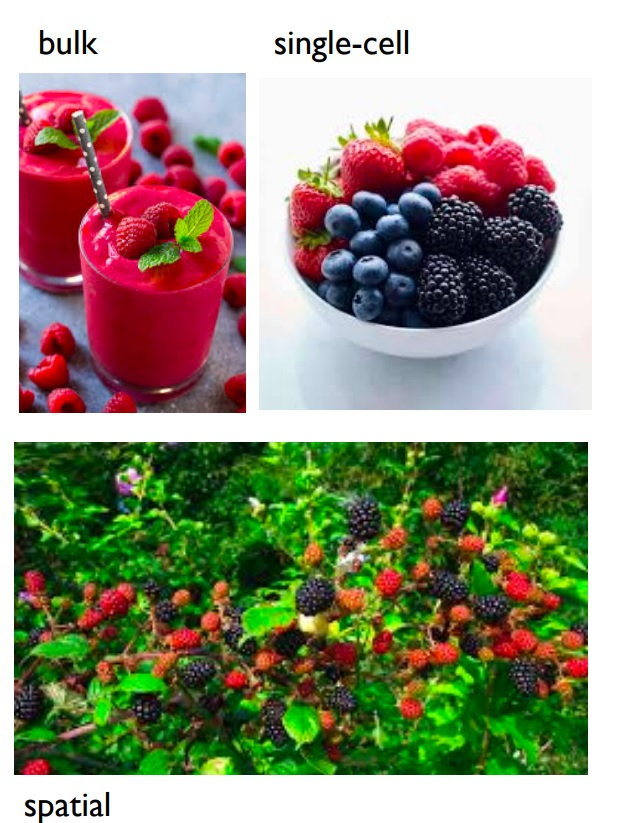
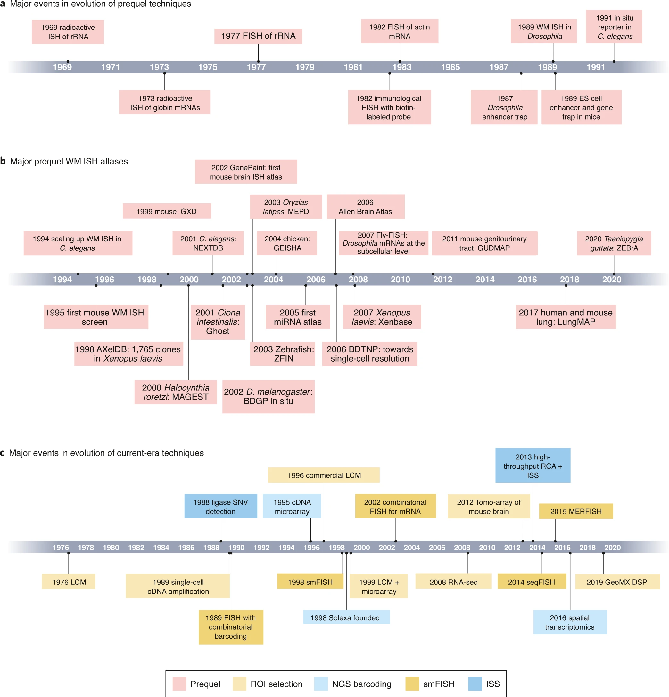
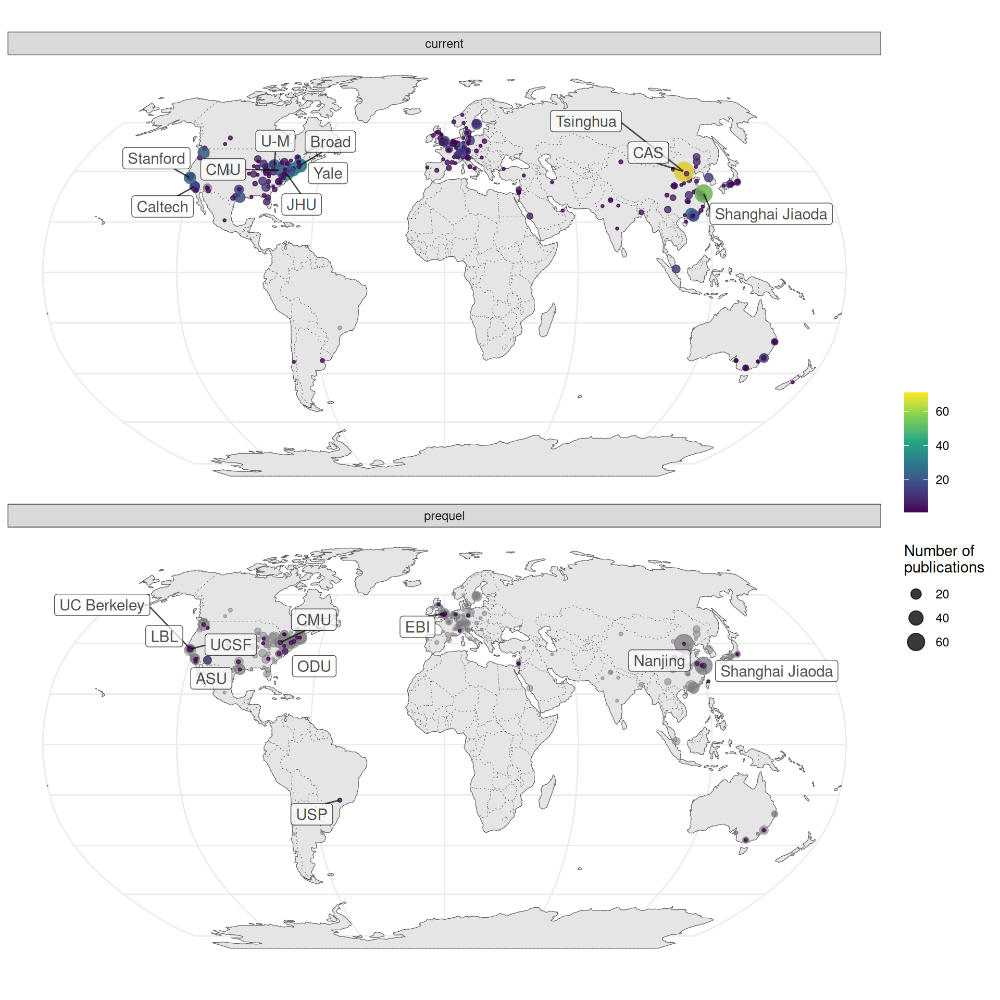
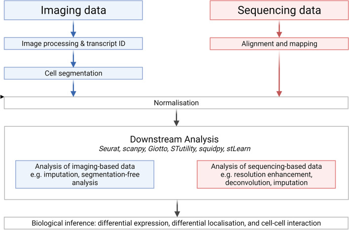

<h3>I found this simple picture very illustrative to differentiate between bulk, single-cell, and spatial transcriptomics:</h3>

- **Bulk** RNA-seq is like a smoothie: it blends all the cells together, losing individual identity.
-  **Single-cell** RNA-seq is like a bowl of mixed berries: each cell is distinct and individually measured.
-   **Spatial** transcriptomics is like observing berries on the bush: you not only see each cell but also where it is located in the tissue.

  

# Best Papers to Start With:

<h3>Here are some highly recommended papers for getting started in spatial transcriptomics:</h3>

I myself started my journey by reading this paper:
- **Moses, L., & Pachter, L. (2022). "Museum of spatial transcriptomics" _Nature Methods_, 19, 534–546.**  
    [Link](https://www.nature.com/articles/s41592-022-01409-2)

**Fig 1.** Timelines of major events (From "Museum of spatial transcriptomics" paper)

This review paper also includes a book-length supplement, which is very helpful and highly recommended. You can find this supplement on the PachterLab GitHub account:
- **Moses, L., & Pachter, L. "A book-length supplement to the paper: Museum of spatial transcriptomics"** 
    [Link](https://pachterlab.github.io/LP_2021/)

  

**Fig 2.** Map of where first authors of current era and prequel data analysis papers were located as of publication (From "A book-length supplement to the paper: Museum of spatial transcriptomics", Chapter 7)
  

After reading the above paper, I would recommend to read this story-telling paper: 

- **Marx, V. (2021). "Method of the Year: spatially resolved transcriptomics." _Nature Methods_, 18, 9–14.**  
    [Link](https://www.nature.com/articles/s41592-020-01033-y)

In one section of the paper, the authors share the story behind Visium — the most widely used commercial method for spatial transcriptomics. Here are a few highlights:

"Patrik Ståhl from KTH explains that it was around 2009 when Karolinska Institute researcher Jonas Frisén set out to see how his lab could reap more information from the typical tissue slide, prepared with stains that date back to the nineteenth century. Frisén reached out to KTH colleague Lundeberg, where Ståhl was a PhD student. Fredrik Salmén was a master’s student at KTH; Ståhl later joined the Frisén lab as a postdoctoral fellow and Salmén became a PhD student in Lundeberg’s lab. A collaborative project in which Ståhl and Salmén worked closely together resulted in a spatial analysis approach whereby fixed, stained tissue is imaged and then permeabilized. The released mRNAs move and attach to an array beneath the tissue with barcoded oligonucleotides, which fixes them in the position they had in the tissue. After reverse transcription the tissue is enzymatically removed. What remains are spatially barcoded complementary DNA molecules attached to the oligo array. Next comes sequencing of these cDNAs. The positional barcodes provide spatially resolved transcriptomic information. The scientists worked hard on an array that captures single cells. “We really wanted to go down to that level,” says Salmén, who was interviewed jointly with Ståhl and is now a postdoctoral fellow in van Oudenaarden’s lab. The method’s resolution ended up being 100 µm, which is tens of cells. Among their many technical challenges was that the mRNAs could diffuse in many directions, which risked inaccurate spatial data or mixed expression patterns, says Salmén. They developed ways to avoid that. “It was a long struggle,” says Ståhl but they and the team managed, and Ståhl and Salmén share first authorship on the paper4. The paper and the process of getting there — the melding of concepts and technology from microarrays, imaging, sequencing, and bioinformatics analysis based on barcodes — has shaped their science and their careers, says Ståhl.

Salmén’s key idea, says Ståhl, was setting up an initial reaction with fluorescent nucleotides to render visible where the cells’ mRNAs meet the array’s surface probes. That, says Ståhl, gives you something to image right where the synthesis of cDNA from the captured mRNA takes place. “You get a very nice fluorescent footprint of where everything went,“ he says. “That was, for us, a gigantic stepping stone into getting the rest to work,” he says. This stepping stone convinced many the method had potential — even the “non-believers,” says Salmén, laughing. Methods development means plenty of failure, he says; in this case, four to five years of failure. The method was commercialized through a spinout company, Spatial Transcriptomics, which was acquired by **10x Genomics** in 2018 and led to the product **Visium**."

And now, it’s time to read the landmark paper by Ståhl P. et al., published in the journal Science in 2016:

- **Ståhl PL, Salmén F, Vickovic S, Lundmark A, Navarro JF, et al (2016). "Visualization and analysis of gene expression in tissue sections by spatial transcriptomics" _Science_, 353, 78-82.**  
    [Link](https://www.science.org/doi/10.1126/science.aaf2403?url_ver=Z39.88-2003&rfr_id=ori:rid:crossref.org&rfr_dat=cr_pub%20%200pubmed)

  

**Fig 3.** Spatially resolved gene expression (From Ståhl P, et al 2016 paper)
  

Another fruitful review paper, I would recommend is this: 

- **Williams CG, Lee HJ, Asatsuma T, Vento-Tormo R, Haque A. (2022). "An introduction to spatial transcriptomics for biomedical research" _Genome Med_, 27, 14(1):68**
    [Link](https://pmc.ncbi.nlm.nih.gov/articles/PMC9238181/)

Apart from introducing different classes of spatial methods, they furthermore introduce bioinformatic methods for analysing spatial transcriptomic data, including pre-processing, integration with existing scRNA-seq data, and inference of cell-cell interactions.

  

**Fig 4.** Typical structure of spatial transcriptomics analysis (From Williams CG, et al 2022 paper)
  

Later, I will add some more resources!